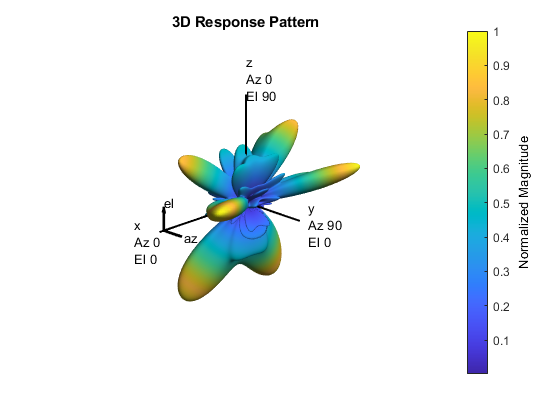

# Massive MIMO Hybrid Beamforming Matlab Example

This example shows how hybrid beamforming is employed at the transmit end of a massive MIMO communications system, using techniques for both multi-user and single-user systems. The example employs full channel sounding for determining the channel state information at the transmitter. It partitions the required precoding into digital baseband and analog RF components, using different techniques for multi-user and single-user systems. Simplified all-digital receivers recover the multiple transmitted data streams to highlight the common figures of merit for a communications system, namely, EVM, and BER.

The example employs a scattering-based spatial channel model which accounts for the transmit/receive spatial locations and antenna patterns. A simpler static-flat MIMO channel is also offered for link validation purposes.

The ever-growing demand for high data rate and more user capacity increases the need to use the available spectrum more efficiently. Multi-user MIMO (MU-MIMO) improves the spectrum efficiency by allowing a base station (BS) transmitter to communicate simultaneously with multiple mobile stations (MS) receivers using the same time-frequency resources. Massive MIMO allows the number of BS antenna elements to be on the order of tens or hundreds, thereby also increasing the number of data streams in a cell to a large value.

The next generation, 5G, wireless systems use millimeter wave (mmWave) bands to take advantage of their wider bandwidth. The 5G systems also deploy large scale antenna arrays to mitigate severe propagation loss in the mmWave band.

Compared to current wireless systems, the wavelength in the mmWave band is much smaller. Although this allows an array to contain more elements within the same physical dimension, it becomes much more expensive to provide one transmit-receive (TR) module, or an RF chain, for each antenna element. Hybrid transceivers are a practical solution as they use a combination of analog beamformers in the RF and digital beamformers in the baseband domains, with fewer RF chains than the number of transmit elements [1].

This example uses a multi-user MIMO-OFDM system to highlight the partitioning of the required precoding into its digital baseband and RF analog components at the transmitter end. Building on the system highlighted in the MIMO-OFDM Precoding with Phased Arrays example, this example shows the formulation of the transmit-end precoding matrices and their application to a MIMO-OFDM system.

[1] Molisch, A. F., et al. "Hybrid Beamforming for Massive MIMO: A Survey." IEEE Communications Magazine, Vol. 55, No. 9, September 2017, pp. 134-141.

